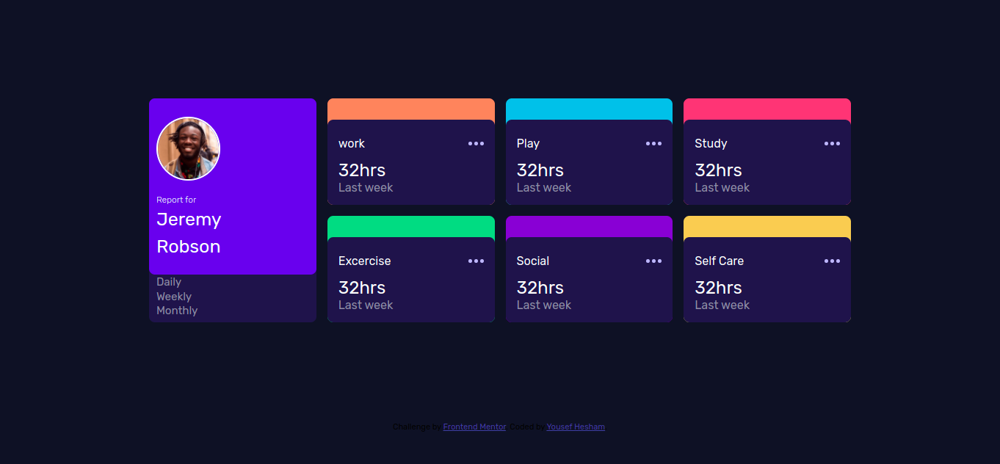

# Frontend Mentor - Time tracking dashboard solution

This is a solution to the [Time tracking dashboard challenge on Frontend Mentor](https://www.frontendmentor.io/challenges/time-tracking-dashboard-UIQ7167Jw). Frontend Mentor challenges help you improve your coding skills by building realistic projects. 

## Table of contents

- [Screenshot](#screenshot)
- [Links](#links)
- [Built with](#built-with)
- [Author](#author)

### Screenshot

### Links

- Solution URL: [solution](https://github.com/yosefHesham/time-dashboard)
- Live Site URL: [demo](https://yosefhesham.github.io/time-dashboard/dist/)

### Built with

- Semantic HTML5 markup
- CSS custom properties
- CSS Grid
- SASS
- Mobile-first workflow

## Yousef Hesham

- Github - [@yosefHesham](https://github.com/yosefHesham)
- Frontend Mentor - [@yosefHesham](https://www.frontendmentor.io/profile/yosefHesham)
